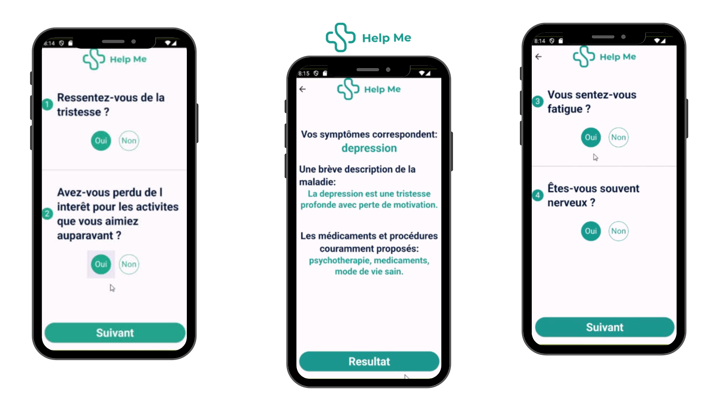
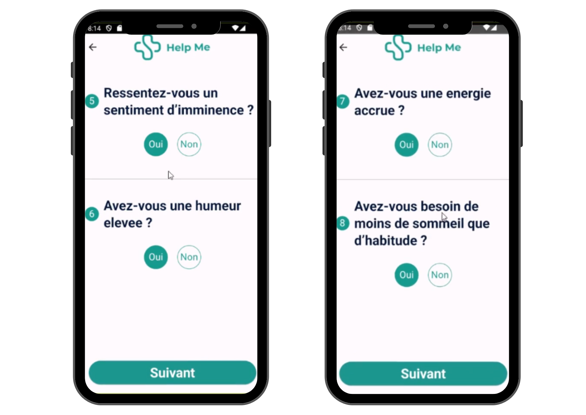
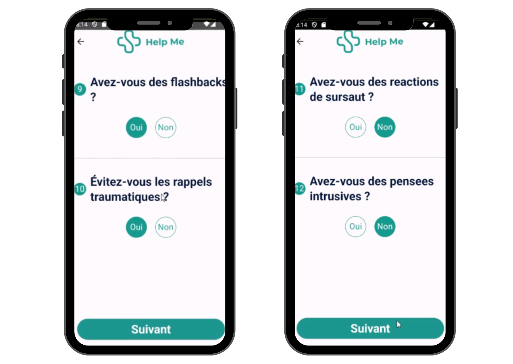
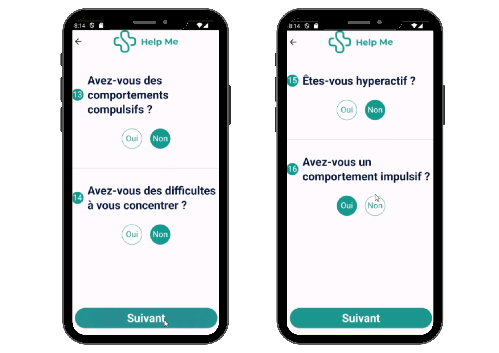
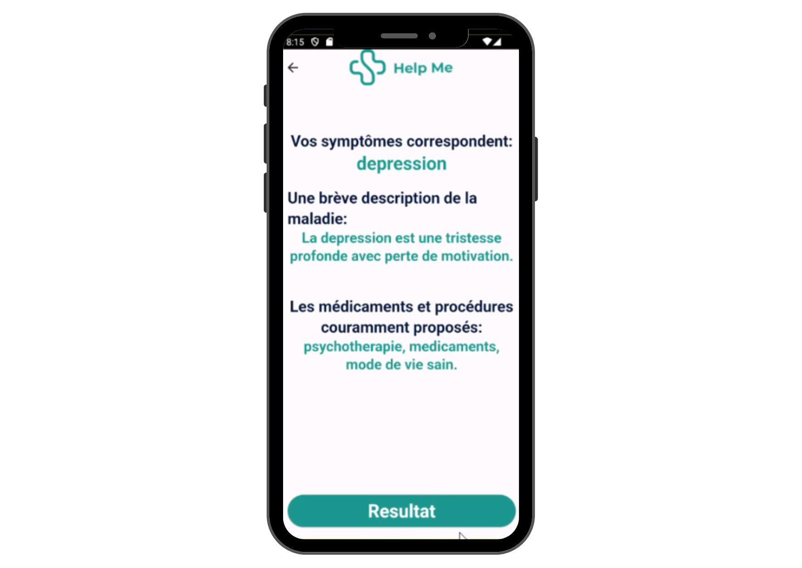

# Mental Health Monitoring System



## Description

This project focuses on monitoring symptoms of **depression**, **anxiety**, and other mental health disorders. The system analyzes these symptoms using **Python** and the **experta library** to provide insights. Results are presented via a **Flutter mobile application**, where users interact by answering questions that help assess and display their mental health status.

## Features

- **Symptom Assessment**: Analysis of depression, anxiety, and other mental health symptoms based on user input.
- **Expert System Integration**: Utilizes the **experta library** to generate personalized insights and recommendations.
- **User Interaction**: The mobile app guides users through a questionnaire to gather data.
- **Mobile App Integration**: Results and insights are available in real-time on the **Flutter** application.

## Screenshot








## Tech Stack

- **Python**: For symptom analysis using the **experta** library.
- **Flutter**: For building the cross-platform mobile application.
- **Firebase**: Used for storing and managing user responses.
- **Experta**: A Python library for building expert systems.

## How to Run

### Python Setup:
1. Install **Python** and **experta**:
   ```bash
   pip install experta

2. Clone the repository:
   ```bash
   git clone https://github.com/ChebbiYahya/Mental-health-monotoring-system.git

3. Navigate to the project directory:
   ```bash
   cd System_Expert

4. Run the analysis:
   ```bash
   python main.py

### Mobile App Setup:
1. Navigate to the Flutter project directory:
   ```bash
   cd antidep

2. Install dependencies:
   ```bash
   flutter pub get

3. Run the app:
   ```bash
   flutter run

      